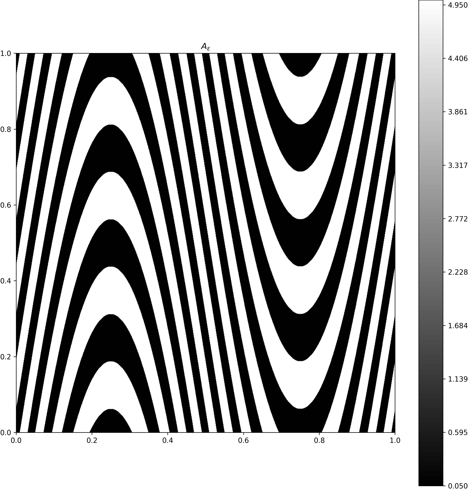
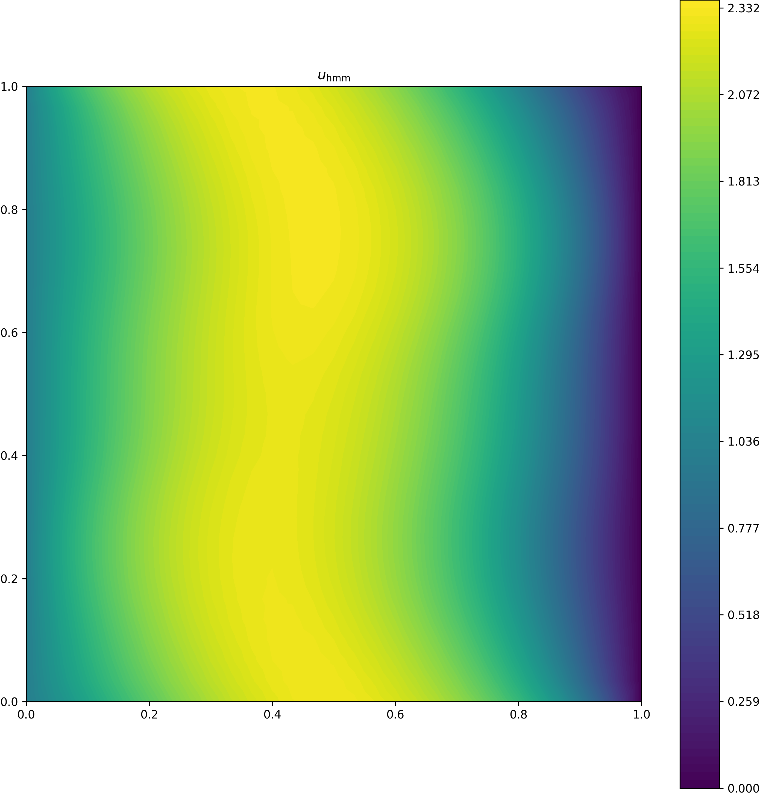
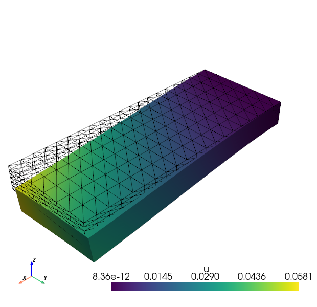

# HOMMX: Heterogeneous Multi-Scale Method with DOLFINx

A Python package implementing the **Heterogeneous Multi-Scale Method (HMM)** for solving multi-scale PDEs using DOLFINx and PETSc.


## Overview

HOMMX provides solvers for multi-scale problems, in particular for the Poisson equation and linear elasticity with rapidly oscillating coefficients. The package implements the HMM to efficiently compute homogenized solutions without fully resolving the microscopic scales.

### Poisson

$$
\begin{equation}
    \mathrm{div}(A_\varepsilon\nabla u) = f
\end{equation}
$$

where $A_\varepsilon(x) = A(x, x/\varepsilon)$.

Additionally it includes an implementation for a stratified periodic coefficient.

### Linear elasticity

$$
\begin{equation}
    \sum_{jkl}\frac{\partial}{\partial x_j}\left(A_{\varepsilon, ijkl}\frac{\partial u_k} {\partial x_l} \right) = f_i
\end{equation}
$$

where $A_{\varepsilon, ijkl}(x) = A_{ijkl}(x, x/\varepsilon)$.

### Key Features

- **PoissonHMM**: HMM solver for Poisson problems with periodic micro-structure
- **PoissonStratifiedHMM**: HMM solver for Poisson problems with stratified periodic micro-structure
- **LinearElasticityHMM**: HMM solver for Linear Elasticity with periodic micro-structure
- **LinearElasticityStratifiedHMM**: HMM solver for Linear Elasticity with stratified periodic micro-structure
- Support for 2D and 3D domains
- Integration with DOLFINx's modern FEM framework
- Parallelization via MPI

### Usage

For now, please refer to the [`examples`](https://github.com/flxrcz/hommx/tree/main/examples) or take a look at the [`tests`](https://github.com/flxrcz/hommx/tree/main/test/integration).

## Installation
hommx is available as a conda package on [Prefix]((https://prefix.dev/channels/flxrcz-forge/hommx)).
To install it simply run

```bash
conda install -c https://repo.prefix.dev/flxrcz-forge hommx
```

## Examples

### Stratified Diffusion
The code that generated those pictures and solves the problems can be found in [diffusion examples](https://github.com/flxrcz/hommx/tree/main/examples/diffusion) directory.

We solve the diffusion equation

$$
\begin{equation}
    \begin{aligned}
    -\mathrm{div}\big(A_{\theta, \varepsilon}(x) \nabla u_{\theta, \varepsilon}(x)\big) &= 1 \hspace{2em}&& \text{in $[0,1]^2$}\\
    u_{\theta, \varepsilon}(x) &= 1 \hspace{2em}&& \text{on $\{(x_1, x_2): x_1=1,\, x_2\in[0, 1]\}\subset\partial \Omega$} \\
    u_{\theta, \varepsilon}(x) &= 0 \hspace{2em}&& \text{on $\{(x_1, x_2): x_1=0,\, x_2\in[0, 1]\}\subset\partial \Omega$} \\
    \nabla u_{\theta, \varepsilon}(x) \cdot n &= 0 && \text{on $\{(x_1, x_2): x_1\in[0, 1],\, x_2=1 \text{ or } x_2=0 \}\subset\partial \Omega$}\, .
    \end{aligned}
\end{equation}
$$

where the coefficient is given by

$$
\begin{equation}
A_{\theta, \varepsilon} = A\left(x, \frac{\theta(x)}{\varepsilon}\right)\, .
\end{equation}
$$


We do this once for a laminated material given by

$$
\begin{equation}
A(x, y) = \begin{cases}
        5 & \text{if $\frac14 < \{y_2\} < \frac34, y_1\in[0,1]$} \\
        0.05 & \text{else}\, .
    \end{cases}
\end{equation}
$$

and

$$
\begin{equation}
    \theta(x) = (x_1, x_2 - \sin(2\pi x_1))\, .
\end{equation}
$$

| | | |
|---|---|---|
|  |  |  |
| $A_{\theta, \varepsilon}$ for $\varepsilon=2^{-2}$ | Reference solution computed on fine FEM mesh with $\varepsilon=$2^{-7}$ | HMM solution |


And on an inclusion-like material given by

$$
\begin{equation}
    A(x, y) = \begin{cases}
        0.001 & \text{if $y_1^2 + y_2^2 \leq \left(\frac{1}{4}\right)^2$} \\
        0.1 & \text{else}\, ,
    \end{cases}
\end{equation}
$$

and

$$
\begin{equation}
    \theta(x) = \left(x_1 + \frac{1}{2} \sin(2\pi x_2), x_2 \right)\, .
\end{equation}
$$

| | | |
|---|---|---|
|  |  |  |
| $A_{\theta, \varepsilon}$ for $\varepsilon=2^{-4}$ | Reference solution computed on fine FEM mesh with $\varepsilon=$2^{-7}$ | HMM solution |

## Linear Elasticity
The code that generated those pictures and solves the problems can be found in [elasticity examples](https://github.com/flxrcz/hommx/tree/main/examples/linear_elasticity) directory.

We solve the equation of linear elasticity given by

$$
\begin{equation}
\begin{aligned}
    \sum_{jkl}\frac{\partial}{\partial x_j}\left(A_{\theta, \varepsilon, ijkl}\frac{\partial u_k} {\partial x_l} \right) &= f_i && \text{in $[0, 1]\times[0, 0.4]\times[0, 0.1]$}\\
    u &= 0 &&\text{on $\{(x_1, x_2, x_3): x_1=0, x_2\in[0, 0.4], x_3\in[0, 0.1]\}$}\, .
\end{aligned}
\end{equation}
$$

where

$$
\begin{equation}
    A_{\theta, \varepsilon, ijkl} = A_{ijkl}\left(x, \frac{\theta(x)}{\varepsilon}\right)
\end{equation}
$$

and $A$ is given by Hooke's Law

$$
\begin{equation}
    (A_{\lambda, \mu})_{ijkl} = \lambda \delta_{ij} \delta_{kl} + 2\mu (\delta_{ik}\delta_{jl} + \delta_{il}\delta_{jk})
\end{equation}
$$

with $\lambda=1$ and

$$
\mu(x, y) = \begin{cases}
    100 & \text{if $y_2^2 + y_3^2 \leq \left(\frac{1}{4}\right)^2$} \\
    0.001 & \text{else}\, .
\end{cases}
$$

The stratification function corresponding to rotated fibers is

$$
\begin{equation}
    \theta(x) = (x_1, x_2, \cos(\gamma(x_2))x_3 - \sin(\gamma(x_2))x_1)
\end{equation}
$$

here $\gamma$ is the rotation of the fibers, and we use a linear rotation from $0$ to $\frac{\pi}{2}$ given by

$$
\begin{equation}
    \gamma(x_2) = \frac{\pi}{2}\cdot\frac{x_2}{0.4}
\end{equation}
$$


